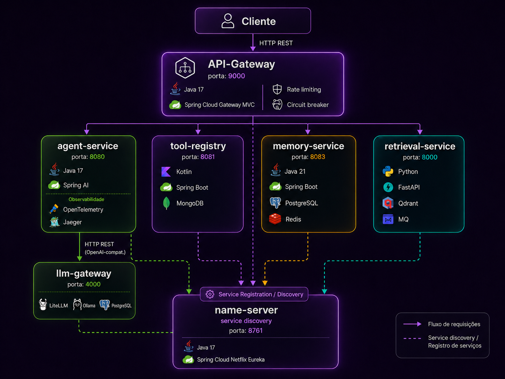

# Relatório — Plataforma de AI Agents

## Vídeo Demonstração

> **[PLACEHOLDER]** Inserir URL do vídeo de demonstração da plataforma no YouTube.

---

## Diagrama de Arquitetura

**Protocolos de comunicação:**
- **HTTP REST** — canal principal entre todos os serviços
- **OpenFeign** — cliente HTTP declarativo no `agent-service` para chamar o `tool-registry`
- **RabbitMQ (AMQP)** — fila assíncrona no `retrieval-service` para ingestão de documentos
- **OpenAI-compatible API** — protocolo exposto pelo `llm-gateway`, permite trocar de modelo sem alterar código

---

## Decisões de Arquitetura

- **API-Gateway** — Spring Cloud Gateway MVC como ponto de entrada único, com rate limiting (Bucket4j + Caffeine) e circuit breaker (Resilience4j) por serviço. O estado do rate limiter é in-memory (Caffeine); em produção com múltiplas instâncias, precisaria ser trocado por Redis para compartilhar estado entre pods.

- **name-server** — Eureka Server para service discovery. Em produção em Kubernetes, o service discovery nativo do K8s (DNS interno + Services) torna o Eureka redundante — poderia ser removido.

- **agent-service** — Spring AI para montar o loop de agente de forma direta no ecossistema Spring. Python (FastAPI) com LangChain seria mais adequado — ecossistema de IA mais maduro, melhor suporte a grafos de raciocínio e integrações de ferramentas prontas.

- **llm-gateway** — LiteLLM como proxy com interface OpenAI-compatível. Trocar de modelo (Ollama local → GPT-4o, Claude, Gemini) é mudança de config, sem alterar código de aplicação.

- **memory-service** — PostgreSQL para histórico de conversas (modelo relacional bem definido, ACID) + Redis como cache de curto prazo para evitar leituras repetidas ao banco.

- **retrieval-service** — Python (FastAPI) faz sentido por ser o serviço mais ML-heavy. Usa FastEmbed para geração de embeddings, mas o catálogo de modelos é fixo e não suporta fine-tuning. Trocar por **Sentence Transformers** seria o caminho natural para adaptar embeddings ao domínio ou ter mais controle de modelo.

- **tool-registry** — Kotlin pela expressividade (data classes, null safety) no ecossistema Spring. MongoDB pelo schema flexível: cada ferramenta tem um `inputSchema` diferente, o que mapeia bem para documento.

---

## Produção em Nuvem

A plataforma roda hoje com `docker-compose` isolado por serviço. Kubernetes é o passo natural para escala e resiliência. Os pontos principais a endereçar:

**Infraestrutura de dados gerenciada:** Qdrant, RabbitMQ, PostgreSQL e Redis não devem rodar como pods stateful simples. O recomendado é usar serviços gerenciados do provedor (RDS para PostgreSQL, ElastiCache para Redis, CloudAMQP/AmazonMQ para RabbitMQ, Qdrant Cloud para vetores) e conectar os pods via Secrets e ConfigMaps.

**Secrets:** Credenciais atualmente em `docker-compose.yml` e `application.yml` precisam ser gerenciadas com Kubernetes Secrets, preferencialmente integrados a um vault (AWS Secrets Manager, HashiCorp Vault).

**LLM em nuvem:** Ollama local é substituído por provedores hospedados (OpenAI, AWS Bedrock, Google Vertex AI) — a troca é apenas no `litellm_config.yaml`.

**Eureka vs. K8s DNS:** Com Kubernetes, o service discovery nativo (DNS interno + ClusterIP Services) substitui o Eureka, simplificando a topologia.

**Escalabilidade:** `retrieval-service` e `agent-service` são os candidatos óbvios para Horizontal Pod Autoscaler (HPA) — processamento de embeddings e chamadas ao LLM são os gargalos de latência e custo.

**Rate limiter:** O API-Gateway usa Caffeine (in-memory). Em múltiplas réplicas no K8s, precisa migrar para `RedisProxyManager` para compartilhar estado entre pods.

**Health probes:** O `memory-service` já expõe probes via Actuator. Os demais serviços precisam ter `livenessProbe` e `readinessProbe` configurados nos manifests antes de ir para produção.

---

## Instalação e Execução Local

As instruções de pré-requisitos, configuração do ambiente e como rodar cada serviço localmente estão em um arquivo separado.

> Consulte o arquivo **`SETUP.md`** para o guia completo de instalação e execução local.
